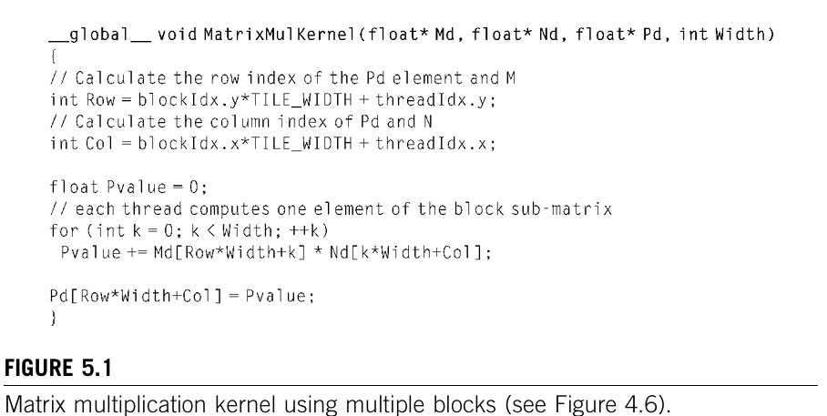
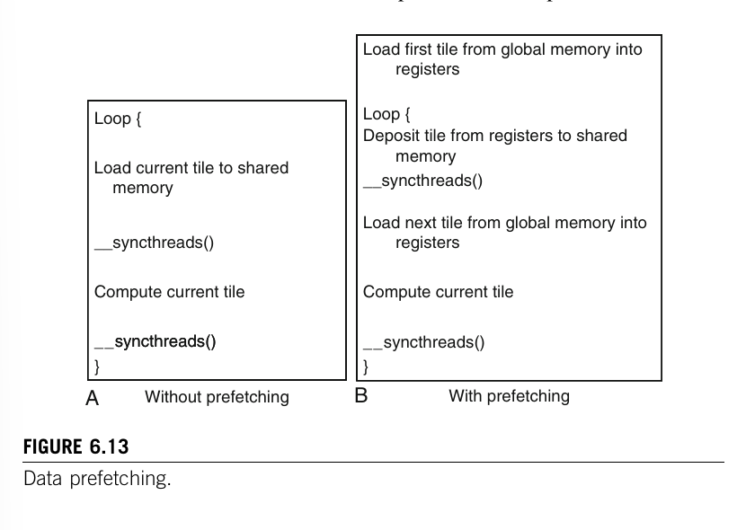

# Programming Massively Parallel Processors

## 1 Introduction

### 1.1 GPUs as Parallel Computers

From sequential Multi-threaded CPUs that prioritize complex control logic and large caches to GPUs that optimiye parallel throughput with massie thread counts and highger memory bandwidth. GPUs have become more accessible and more accurate with double precision Floating-point arithmetic (FPA) (Note: this book is from 2010). Until we got CUDA. 

CUDA is a C/C++ library that uses a familiar language instead of clunky GPU apis that were common before. 

### 1.2 Architecture of a Modern GPU

Each GPU has Streaming Multi-processors (SMs) and within each SM there are multiple streaming processors (SPs). The G80 for example has 128 SPs (16 SMs, each with 8 SPs), each with a  multiply–add (MAD) unit and an additional multiply unit. This apparently sums to a 500 gigaflops. 
Each SP has 96 threads and gives us over 12,000 threads, way more than the 2-4 threads per core that intel CPUs had at that time.

Additionally, each GPU had up to 4 gigabytes of graphics double data rate (GDDR) DRAM, also refered to as global memory (lives on the GPU; not to be confused with system memory). That DRAM memory has a memory bandwidth of 86 GB/s and a communication bandwithd with the CPU of 8 GB/s. 

All of these values have changed to now adays but the proportions have likly stayed the same.

### 1.3  Why More Speed or Parallelism?

Simple argument that speed has a lower growth curve than parallism in terms of GFLOPs per GPU vs CPU. One interesting point is that not all compute heavy processes can be ran efficiently in parallel, but since we want to make AI go BRRR, that's not an issue.

### 1.4  Parallel Programming Languages and Models

I skipped this chapter. I don't care about old languages. They have mentioned an interesting 

### 1.5 Overarching Goals

1. Even though computer architecture is necessary, students are supposed to be able to learn the important topics and algorithms from the book without specific knowledge. This book tries to explain these topics on the go. 
2. Complete abstraction is not possible and for really maximizing the performance it is necessary to understand the underlying GPU arch. (Reminds me of flash-attn 4 that only works on hopper and blackwell GPUs).
3. The way this book works is supposed to help programs become more parallizable as time continues (don't ask me how exactly)

### 1.6 Organization of the book

This section is already very trimmed but let me try. 

1. Introduction 
2. History of GPUs movements, GPGPUs, historic developments deepens understanding of current and future ones as well.
3. Simple CUDA progam going through all steps. (1) Isolate data us by parallelized code and transfer it to computing device, (2) developing and launching a parallel kernel function, (3) transferring data back to host processor. 
4. (-7.) CUDA concepts, thread organization, special memories, factors on performance and precision and accuracy. These chapters help to understand general parallel computing concepts. 
8. (-9.) Case Studies
10. Generalizations from problem formulation to algorithm strategies.
11. OpenCL the "new" programming language.
12. Conclusion

## 2 History of GPU Computing

I want to LEARN CUDAAA.
The inrtoduction claims that understanding the history will help programmers understand architectural choices that were made: massivemultithreading,
relatively small cachememories compared to central processing units (CPUs), bandbandwidth-centricmemoryinterfacedesign; and help project the future evolution of GPUs.

### 2.1 EvolutionofGraphicsPipelines

### 2.1.1 TheEraofFixed-FunctionGraphicsPipelines

### 2.1.2 EvolutionofProgrammableReal-TimeGraphics

### 2.1.3 Unified Graphics and Computing Processors

### 2.1.4 GPGPU:An Intermediate Step

### 2.2 GPU Computing

### 2.2.1 Scalable GPUs

### 2.2.2 Recent Developments

### 2.3 Future Trends


## 3 Introduction to CUDA

CUDA programmer use a host (CPU) and a (or multiple) device(s) which are massively parallel processors. 

### 3.1 Data Parallelism
The example is stated that a dot-product is highly parallelizable, because each output depends on one row and column and doesn't change the solution for any other value. If we have two 12.000^2 matrices the G80 could solve it in its over 12.000 threads efficiently. 

### 3.1 Excercise  

If each dot product in a 1000×1000 matrix multiplication is assigned to one CUDA thread, and each thread must read 1000 elements from M and 1000 from N, how many total memory reads occur globally? How does this expose the critical role of shared memory, even though the text doesn't mention it here?

### 3.2 CUDA Program Structure
A CUDA program is a unified source code for both host and device code. The NVIDIA C compiler (nvcc) seperates the two into ANSI C code that is compiled with the hosts standard C compiler and ANSI C code that is extended with keywords for labeling data-parallel functions, called kernels. 

The kernel initializes a big number of threads to exploit parallelism. In the 1000x1000 matrix multiplication example we would initiate 1,000,000 threads. 

These threads take very few cycles to generate in contrast to CPU threads.

### 3.3 A Matrix-Multiplication Example

Here we just see a simple CPU implementation in normal C with three loops. We also get to see a simple scafolding for CUDA programs.

### 3.4 Device Memories and Data Transfer

Allocate Memory on the device transfer it with an API and after execution the memory has to be transfered back and the memory has to be freed up again. 
cudaMalloc() allocates a a piece of memory to the global memory in the device. To copy data we use the cudaMemcpy() function. 

### 3.5 Kernel Function and Threading

Because the same kernel function runs on each thread, CUDA is an instance of the single-program, multiple-data (SPMD) parallel programming style. 
In front of a kernel we use the "\__global__\" keyword to show the host that this method generates a grid of threads on the device.
In order for each kernel in a thread to disinguish itself it calls the threadIdx.x or threadIdx.y variables that give it its coordinates (0,0 or 1,20). They can be used together with the blockDim to access different partitions of the data in global memory.
The two outerloops in the CPU implementation are now actually the threads x and y dimensions in the grid. 

### 3.6 Summary
Contains mostly the same information as the chapter and encourages the reader to consult the CUDA Programming Guide. 


### 3.7 Exercise Solutions 
3.1 It would be 2B reads which explains why fast memory bandwidth is the main accelerator for good GPU performance

## 4 CUDA Threads

This chapter presents more details on th eorganization,resource assignment, and scheduling of threads in a grid.

### 4.1 CUDA Thread Organization

In general each grid consists of blocks that are arranged in two dimensions. Each thread inturn has threads that are arranged in 3D. How we want to allocate these dimensions is fully our decision and is only constrained by the total number of threads that our GPU has. If we have 512 threads available it is possible to use (4, 4) blocks and (2,8,2) threads but its not possible to increase any of these dimensions, without exceeding the 512 threads. 
In order to find the index of the thread we use this code line: int row = blockIdx.x * blockDim.x + threadIdx.x.

### 4.2 Using blockIdx and threadIdx

This is actually the first interesting algorithm. We use tiling! We split the input matrices into tiles that can be each processed by one block. For that we will need to add int Width in the kernel arugment and access elements of M in the global memory by row*width + k.

### 4.3 Synchronization and Transparent Scalability
Using __syncthreads() we can halt all threads in a block until they all reached this line. Usually this works well because durin runtime CUDA assigns threads in a block as a unit, all at once. This means that order at which each block is executed is not specified by default. With more resources we could execute 8 blocks at a time consuming more energy and in low-power edge IoTs we could execute 2 blocks at a time. This is called transparent scalability.

### 4.4 Thread Assignment
Simple reiteration of SMs and SPs and how transparent scalability works there. If one SMs can accomodate up to 8 blocks with 128 threads we can reduce the number of blocks and increase the number of threads but not vice-verca. 

### 4.5 Thread Scheduling and Latency Tolerance
Threadd scheduling is tightly coupled with hardware architecture. In CUDA programing the scheduler for threads works in warps, which consist of 32 threads. The large number of warps (on a G80 with 768 threads/SM it's 24) foregoes the need of branch prediction mechanisms and cache memories, because if long-latency operations could introduce idle time the warp scheduler can select ready warps, which is reffered to a zero-overhead thread scheduling. 

### 4.6 Summary 
All of the above points reiterated. 

### 4.7 Exercises

#### 4.7.1 
A student mentioned that he was able to multiply two 1024 1024
matrices using a tiled matrix multiplication code with 1024 thread
blocks on the G80. He further mentioned that each thread in a thread
block calculates one element of the result matrix. What would be your
reaction and why?


#### Answer

How the fuck did you manage to solve the problem with only calculating 1024 if the resulting matrice has ovre a million elements?

#### 4.7.2 
The following kernel is executed on a large matrix, which is tiled submatrices. To manipulate tiles, a new CUDA programmer has written the following device kernel to transpose each tile in the matrix. The tiles are of size BLOCK_SIZE by BLOCK_SIZE, and each of the dimensions of matrix A is known to be a multiple of BLOCK_SIZE. The kernel invocation and code are shown below. BLOCK_SIZE is known at compile time but could be set anywhere from 1 to 20.

``` 
dim3 blockDim(BLOCK_SIZE,BLOCK_SIZE);
dim3 gridDim(A_width/blockDim.x,A_height/blockDim.y);
BlockTranspose<<<gridDim, blockDim>>>(A, A_width, A_height);
__global__ void
BlockTranspose(float* A_elements, int A_width, int A_height)
{
__shared__ float blockA[BLOCK_SIZE][BLOCK_SIZE];
int baseIdx = blockIdx.x * BLOCK_SIZE + threadIdx.x;
baseIdx = (blockIdx.y * BLOCK_SIZE + threadIdx.y) * A_width;
blockA[threadIdx.y][threadIdx.x] = A_elements[baseIdx];
A_elements[baseIdx] = blockA[threadIdx.x][threadIdx.y];
}
```

Out of the possible range of values for BLOCK_SIZE, for what values of BLOCK_SIZE will this kernel function correctly when executing on the device?

#### Answer
Only for BLOCK_SIZE < 6. The problem is that blockA is shared between all threads in a block.Each thread writes to blockA[tx,ty] and then reads blockA[ty,tx], but there is no guarantee that blockA[ty,tx] is populated. If BLOCK_SIZE < 6, then there are 25 threads or less and we can gurantee that they all start  in one warp and are initialized at once. 


#### 4.7.3 
If the code does not execute correctly for all BLOCK_SIZE values, suggest a fix to the code to make it work for all BLOCK_SIZE values.


#### Answer 
We can add a _syncthreads() before reading blockA and have all threads in the block finish their writing process. This prevents reading empty elements. 


## 5 CUDA Memories

The kerenels that have been shown until now all access the global memory or DRAM. This memory suffers from a smaller bandwidth and takes more clock cycles to be read from. This chapter shows how to boost the efficiency of CUDA kernels using different memories. 

### 5.1 Importance of Memory Access Efficiency



The compute to global memory access (CGMA) ratio determines how close the kernel function can perform to the theoretical perfromance limit in terms of floating-point operations per second (flops). 

In the code matmul function from chapter 4, the most important part is the loop, which contains two global memory accesses and one floateing-point addition per iteration. Thus the CGMA ration is at 1.0.
### 5.2 CUDA Device Memory Types


Simple information here. The memory hierarchy spans from global/constant memory which all threads can access to is bigger but has less bandwidth, to registers which each thread has its own. Registers are very small but have extremely high bandwidth.

Table with keywords to specify scope (single thread, block or whole GPU) and lifetime (single kernel execution or whole application). 


 
### 5.3 A Strategy for Reducing Global Memory Traffic

The first strategy is tiling. We have seen it before but now we have the tools to store it into shared (Block) or register memory, which is faster. 

The second strategy is that threads collaborate on loading data into shared memory. They each load a different subset of that data but can all access this shared data. In the example the threads each store a partial solution and improve the result through phases. 

The tiling algorithm presented can achieve Nx better performance if where N is Tile_width for NxN tiles. 

# 5.4 Memory  as a limiting Factor to Parallelism
It's important to remember that if we exceed the capacity of shared memory we end up with less threads per block.

If we use all available 768 threads in a SM each thread has 10 registers. If we use 11 registers the amount of blocks will be reduced until the capacity is restored. 

This is one of the factors that have to be adjusted depending on the GPU in question.

### 5.5 Summary
Everything from above and the fact that tiling is also effective in all types of parallel computing systems. Parallel algorithms need to perform _local_ data lookups in order to perform efficiently.

### 5.6 Exercises
#### 5.6.1

Consider the matrix addition where each element of the output matrix is the sum of the corresponding elements of the two input matrices. Can one use shared memory to reduce the global memory bandwidth consumption? Hint: Analyze the elements accessed by each thread and see if there is any commonality between threads.

#### Solution

Yes we can use a simple tiling algorithm for that. We hold both tiles of matrix A and B in the registry and compute the matrix addition accordingly.

### 5.6.2
Draw the equivalent of Figure 5.4 for an 8x8 matrix multiplication with 2x2 tiling and 4x4 tiling. Verify that the reduction in global memory bandwidth is indeed proportional to the dimension size of the tiles.

### Solution
Well that's gonna be difficult.

## 6 Performance Considerations

This chapter goes over all the bottlenecks that will help you optimize kernel functions.

### 6.1 More on Thread Execution

A block is partitioned into warps. If a block is not a multiple of 32 it is padded with more threads to complete a 32-thread warp.

When we use if-then-else flows in our kernels the threads in a warp can diverge, which means that the threads of a wrap don't run in parallel anymore. Some threads follow the "if" path and others the "else" path in sequence. Now adays compilers minimize and restructure divergent paths, but nonetheless it's an issue to be kept in mind.

Divergence can also happen in loops with varying numbers of iterations within a thread. 

In the book a sum reduction kernel was illustrated, where reducing the divergence by using strides they could increase performance.

### 6.2 Global Memory Bandwith

This section explains memory coalescing which is used in conjunction with tiling to improve performance. 

DRAM generally is slow but it can access memory that is close in parallel. This process is called coalescing and can be demonstrated with matrices. 

Matrices in CUDA C are stored in row-major (Xd). This means that using tiling if threads iterate down a column they could coalesce the memory calls. They would load one row at a time which all lays in a small memory space. Iterating over columns would lead to far appart DRAM accesses and would not be coalesced.

Coalescing works because weak capacitors can share the charge to the sensors.

### 6.3 Dynamic Partitioning of SM Resources

An SM can have up to a fixed number of blocks. Therefore, its important to assign each block with enough threads so that the whole SM is utilized. The number of blocks per SM is determined during runtime. This can cause _performance cliffs_, if for example a SM is fully utilized and each thread uses its full amount of registers. If the kernel adds one scalar (automatic look 5.2) variable to each thread, which means one extra register,it would mean that there would be a whole number (1, 2,...) of blocks less in each SM. (Refer to CUDAs _Occupancy Calculator_ for more info)

There could be also a benefit in adding an automatic variable which could help with memory and decrease the number of necessary idle warps to guarantee zero-overhead scheduling.  
The added register use would have to to increase the number of indepenedent instructions in between global memory accesses. 

### 6.4 Data Prefetching


As (cryptically) mentioned in the previous part, increasing the number of registers can improve the overall kernel efficiency. Prefetching increases the number of _independent instructions_. 
The previous algorithm was doing two instructions in one line: global memory access into registers and moving stored data into shared memory. These two actions are seperated in the new algorithm, which reduces the amount of time each thread has to wait for the global memory access data. 

You are encouraged to implement the first algorithm in ch_6/ yourself to use the data prefetch algorithm before looking at the solutions.

### 6.5 Instruction Mix 

Very interesting idea. When looking at the dot-product loop we can see that each iteration we incur a address arithmetic instructions. Given that we perform two floating-point calulations in each iteration, only two thirds of instructions bring us to the solution. 

The resolution is to unrol the for-loop, which is only possible if the tile-size is known beforehand.

NVCC **automatically** unrolls small loops nowadays. 

### 6.6 Thread Granularity

The idea is simple we can increase the number solutions each thread computes. The trade-off would be between more solutions, less global memory access and more registers in use -> potentially less blocks per SM. 

For our dot-product example it would mean that since row_i is responsible for all out_ij (j e [0;N-1]), we could make the thread _less granular_ and reuse the tiled row_i for two out_ij for two different js. 

### 6.7 MEASURED PERFORMANCE 67

In the book they've experimented with all the techniques and showed that using all techniques makes the resources interact too much without the benefit of them all.

Observations: 

Below 16x16 tiling the techniques had virtually no effect because the bottleneck was purely due to the DRAM bandwith. 

Increasing the thread granularity had a constant improving effect. Unrolling the loop had an average improving effect of 20% on the 16x16 tiling experiments. 


### 6.8 Exercises
#### 6.1
The kernels in Figure 6.2 and 6.4 are wasteful in their use of threads; half of the threads in each block never execute. Modify the kernels to eliminate such waste. Give the relevant execute configuration parameter values at the kernel launch. Is there a cost in terms of extra arithmetic operation needed? Which resource limitation can be potentially addressed with such modification? Hints: Line 2 and/or Line 4 can be adjusted in each case, and the number of elements in the section may increase.

## 7 Floating Point Considerations
This section talks about various effects that the accuracy of voting point operations has. 

### 7.1 Floating Point Format

The representation of floating points following the IEEE format have three components: a sign (S), a mantissa (M) and a exponent (E). 
The formula is:

\[ Value = (-1)^S \times 1.M \times 2^{E}\]


The sign is very easily explained (-1)^0 is 1 and (-1)^1 is -1. 

The mantissa needs different a forced range because otherwise numbers could have mutliple representations. That's called the _normalized represesentation_ of M.

Honestly, reading _excess encoding_ has not equiped me to summarize this part. The exponent is there two increase the range of values. They encode the value in such a way that comparing smaller and bigger numbers is fast, because usigned comparators are faster in hardware implementation. (Don't listen to what I say just read an article about Excess Encoding)

### 7.2 Representable Numbers
